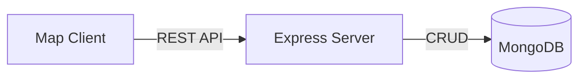

---

# 🗺️ Map Service API

A lightweight service for managing **Polygons** and **Objects** on an interactive map.
Supports create, update, and delete operations with persistence in MongoDB.

---

## 🚀 Installation & Run

```bash
# 1. Clone repository
git clone https://github.com/ChaimCymerman0548492309/MapServer
cd map-service

# 2. Install dependencies
npm install

# 3. Configure environment
cp .env.example .env
# edit MONGO_URI in .env

# 4. Run locally
npm run dev

# 5. Run tests
npm test
```

Default server URL: **[http://localhost:4000](http://localhost:4000)**

---

## 📂 Data Schemas

### Polygon

```ts
{
  _id: string,
  name: string,
  coordinates: number[][][] // GeoJSON Polygon
}
```

### Object

```ts
{
  _id: string,
  type: string,              
  coordinates: [number, number] // [lng, lat]
}
```

---

## 🌐 API Routes

| Method | Endpoint      | Description        |
| ------ | ------------- | ------------------ |
| GET    | /polygons     | Get all polygons   |
| POST   | /polygons     | Create new polygon |
| DELETE | /polygons/:id | Delete polygon     |
| GET    | /objects      | Get all objects    |
| POST   | /objects      | Create new object  |
| DELETE | /objects/:id  | Delete object      |

### Example: Create Polygon

```json
{
  "name": "Area A",
  "coordinates": [[[34.78,32.07],[34.79,32.07],[34.79,32.08],[34.78,32.08],[34.78,32.07]]]
}
```

### Example: Create Object

```json
{
  "type": "jeep",
  "coordinates": [34.78, 32.07]
}
```

---

## ✅ Tests

Run unit & integration tests (Jest + Supertest):

```bash
npm test
```

Covers:

* polygon create / get / delete
* object create / get / delete
* validation + error handling

---

## 🔗 Flow Overview



---
